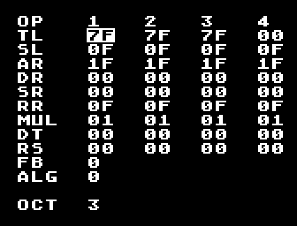

# Pseym

Pseym (parameter setter for YM2612) is a retro-style instrument editor for the
Yamaha YM2612 FM sound chip (or the functionally equivalent YM3438), found on
the Sega Genesis/Mega Drive. Its keyboard-driven user interface aims to make
the editing process more efficient.



The inspiration comes directly from Hexter's "retro" editor
(http://smbolton.com/hexter.html).

The program's source code repository can be found at
https://github.com/M374LX/pseym.

## Keys

**Alphanumeric keys:** Preview the sound on different musical notes
(Z for C, S for C#, X for D and so on; Q, 2, and W for the same notes one
octave higher).

**=/-:** Increase/decrease octave for note previewing.

**Arrow keys:** Move the cursor around the parameters on the screen.

**Home/End:** Move the cursor to the top/bottom of the screen.

**Shift+Home/End:** Move the cursor all the way left/right.

**Page Up/Down:** Increase/decrease the value of the selected parameter by 1.

**Shift+Page Up/Down:** Increase/decrease the value of the selected parameter
by hexadecimal 10.

**Ctrl+Page Up/Down:** Set the value of the selected parameter to the
maximum/minimum.

**F5:** Save the current instrument to the file "instr.eif" (version 0.1) or
"pseym-instr.eif" (latest commit). At present, Echo's EIF is the only supported
format.

**Esc:** Quit

## Instrument loading

If a file named "instr.eif" (version 0.1) or "pseym-instr.eif" (latest commit),
in Echo's EIF format, is present on the directory Pseym is started from, it
will be automatically loaded. Otherwise, it will default to a simple sine wave.

## Register reference

A full explanation of each parameter on the screen is out of the scope of this
document. A reference can be found at https://plutiedev.com/ym2612-registers.

SSG-EG is currently not supported.

## Building from source

Building the program from source requires the SDL2 library. On Debian, the
package is ``libsdl2-dev``. For building on Windows, the library can be
downloaded from the section "Development Libraries" at
https://libsdl.org/download-2.0.php (only MinGW has been tested).

On Linux, just run ``make``. The resulting executable is called ``pseym``. The
makefile assumes the C compiler is GCC. If this is not the case, the makefile
needs to be modified.

On Windows, it requires MinGW with ``mingw32-make``. The makefile assumes MinGW
is installed at C:\MinGW. To build the program, run ``mingw32-make``. The
resulting executable is called ``pseym.exe``.

It has been tested with GCC version 9.3.0.

## License

```
Copyright (C) 2020-2022 M-374 LX <wilsalx@gmail.com>

Pseym is free software; you can redistribute it and/or modify
it under the terms of the GNU General Public License as published by
the Free Software Foundation; either version 2 of the License, or
(at your option) any later version.

Pseym is distributed in the hope that it will be useful,
but WITHOUT ANY WARRANTY; without even the implied warranty of
MERCHANTABILITY or FITNESS FOR A PARTICULAR PURPOSE.  See the
GNU General Public License for more details.

You should have received a copy of the GNU General Public License along
with Pseym; if not, write to the Free Software Foundation, Inc.,
51 Franklin Street, Fifth Floor, Boston, MA 02110-1301 USA.
```

